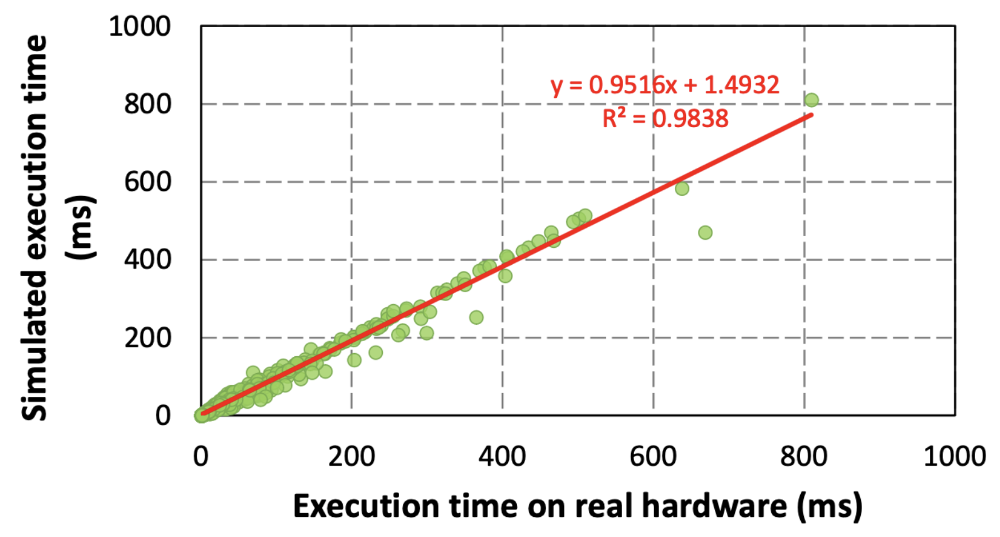
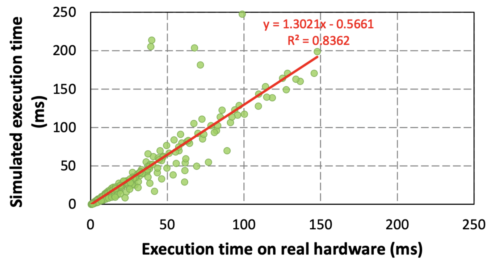

# 📖 Introduction

**Welcome to the uPIMulator Framework Documentation!**

This documentation serves as your comprehensive guide to the uPIMulator framework, catering to both novice and experienced researchers.
Here, you'll find the resources necessary to leverage uPIMulator effectively for your research projects.

We provide in-depth coverage of uPIMulator's features, from foundational concepts to advanced functionalities.
Explore this documentation to unlock the full potential of uPIMulator and elevate your research endeavors.

# 🤙 Contact Information
## 📍 Address
[KAIST](https://www.kaist.ac.kr/en/), School of Electrical Engineering

[Vertically Integrated Architecture Research Group](https://sites.google.com/view/kaist-via/home)

Office: N1 818 @ [KAIST](https://www.kaist.ac.kr/en/)

## 📧 Email
- Bongjoon Hyun: [bongjoon.hyun@gmail.com](mailto:bongjoon.hyun@gmail.com)
- Taehun Kim: [taehun.kim@kaist.ac.kr](mailto:taehun.kim@kaist.ac.kr)
- Dongjae Lee: [dongjae.lee@kaist.ac.kr](mailto:dongjae.lee@kaist.ac.kr)
- Minsoo Rhu: [minsoo.rhu@gmail.com](mailto:minsoo.rhu@gmail.com)

Please feel free to reach out to us if you have any questions or require further assistance.

# 🧑‍💻 Released Versions
> **uPIMulator: A Flexible and Scalable Simulation Framework for General-Purpose Processing-In-Memory (PIM) Architectures**

uPIMulator is a cycle-level performance simulator tailored for general-purpose Processing-In-Memory (PIM) systems adhering to the UPMEM Instruction Set Architecture (ISA). This tool provides a detailed simulation environment, empowering computer architecture researchers and PIM program developers to investigate and harness the capabilities of PIM technology.

For comprehensive insights into uPIMulator and its applications, refer to our HPCA-2024 publication:

"[Pathfinding Future PIM Architectures by Demystifying a Commercial PIM Technology](https://www.computer.org/csdl/proceedings-article/hpca/2024/931300a263/1VOAAZSdy0w)", HPCA, 2024

The currently available versions are:
1. Python & C++ version
2. Go version
3. Go & virtual machine version

All source code and version history can be accessed in our GitHub repository.

## The Python & C++ Version
This is our initial implementation of uPIMulator, used in our HPCA-2024 publication. 
You'll find it in the `python_cpp` directory.  Refer to the included [README](./python_cpp/README.md) for usage instructions.

## The Go Version
Our second implementation, optimized for speed and memory efficiency.
Located in the `golang` directory, it offers an 8.5x speed increase and 7.5x memory reduction due to multi-threading.
We generally recommend this version for most use cases. See the [README](./golang/README.md) for details.

## The Go & Virtual Machine Version
This latest version extends the Go version with virtual machine capabilities, eliminating the need for manual data preparation code in many scenarios.
It's particularly suitable for complex or dynamic benchmarks where manual data preparation is challenging, though it may not offer the fastest simulation speed.
Refer to the [README](./golang_vm/README.md) for further guidance.

# 🔍 Summary of Correlation Ratio (R²) and Mean Absolute Error (MAE)
## Single DPU

## Multiple DPUs

- Each data point represents a single kernel from the PrIM benchmark suite.
- Summary of Correlation Ratio (R²) and Mean Absolute Error (MAE) for single- and multi-DPU simulations:

| Scenario | Total Data Points | Correlation (R²) | MAE |
|---|---|---|---|
| Single DPU (no inter-DPU communication) | 710 | 98.4% | 12.0% |
| Multi-DPU (with inter-DPU communication) | 387 | 83.6% | 26.9% |

- The validation results were obtained using the Python & C++ version of uPIMulator.

# List of Supported Instructions
- uPIMulator currently supports 599 out of the 970 instructions defined in the [UPMEM-PIM ISA](https://sdk.upmem.com/2023.2.0/201_IS.html#instruction-set-architecture).
Due to limitations in the publicly available ISA documentation, support for the remaining 371 instructions is pending.
However, the currently supported instructions have been sufficient to enable functionally correct simulations of the [PrIM benchmark suite](https://github.com/CMU-SAFARI/prim-benchmarks), producing results consistent with those obtained on real UPMEM-PIM hardware.

- For a detailed list of the currently supported instructions, please refer to [this Google spreadsheet](https://docs.google.com/spreadsheets/d/1xq8t6aRvafmTlGmy4Am8i3QmoOzli1heNxLmCEIlCv4/edit?usp=sharing).

# 🪨 Materials
- Bongjoon Hyun, Taehun Kim, Dongjae Lee, and Minsoo Rhu, "[Pathfinding Future PIM Architectures by Demystifying a Commercial PIM Technology](https://www.computer.org/csdl/proceedings-article/hpca/2024/931300a263/1VOAAZSdy0w)", *The 30th IEEE International Symposium on High-Performance Computer Architecture ([HPCA-30](https://hpca-conf.org/2024/))*, Edinburgh, Scotland, Mar. 2024
    - ${\textsf{\color{red}Best Paper Award}}$
    - Acceptance rate: 18% (75 among 410)
    - [Slide](https://drive.google.com/file/d/1TRgFu6YdBu2gtdtDKIuJI85u8Be8w60M/view?usp=sharing)
    - [Presentation](https://youtu.be/e-RXYl568fw?si=LbTYbM7p7qod-L8w)

# 🎁 Contributions
We welcome and encourage contributions to uPIMulator!
If you are interested in contributing or have questions, please feel free to open an issue or submit a pull request.

## List of Maintainers
- Bongjoon Hyun (bongjoon.hyun@gmail.com)
- Taehun Kim (taehun.kim@kaist.ac.kr)
- Dongjae Lee (dongjae.lee@kaist.ac.kr)
- Minsoo Rhu (minsoo.rhu@gmail.com)

## List of Contributors

# 🙏 Acknowledgement
We would like to thank the developers of the [PrIM benchmark suite](https://github.com/CMU-SAFARI/prim-benchmarks), which was instrumental in developing this project.

This research is funded by the generous support from the following organizations:
- Institute of Information & Communications Technology Planning & Evaluation (IITP) grant funded by the Korea government(MSIT) (No. 2022-0-01037, Development of High Performance Processing-in-Memory Technology based on DRAM) and the Korea government(MSIT) (No.RS-2024-00438851, (SW Starlab) High-performance Privacy-preserving Machine Learning System and System Software)
- National Research Foundation of Korea (NRF) grant funded by the Korea government (MSIT) (NRF-2021R1A2C2091753)
- Samsung Electronics

We appreciate their commitment to advancing research in this field.

## 📔 Citation
Bongjoon Hyun, Taehun Kim, Dongjae Lee, and Minsoo Rhu, "[Pathfinding Future PIM Architectures by Demystifying a Commercial PIM Technology](https://www.computer.org/csdl/proceedings-article/hpca/2024/931300a263/1VOAAZSdy0w)", IEEE International Symposium on High-Performance Computer Architecture (HPCA), March 2024.
