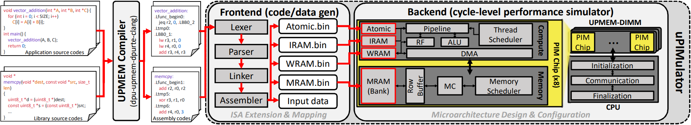

# 📖 Introduction

uPIMulator is a cycle-level performance simulator designed for general-purpose Processing-In-Memory (PIM) enabled memory systems targeting the UPMEM Instruction Set Architecture (ISA).
It offers a detailed simulation environment for computer architecture researchers as well as PIM program developers interested in exploring the potential of PIM technology.

For more details about the simulator and its use-cases, please refer to our paper published in HPCA-2024, 
"[Pathfinding Future PIM Architectures by Demystifying a Commercial PIM Technology](https://arxiv.org/abs/2308.00846)", HPCA 2024

Currently, uPIMulator has two versions: the Python & C++ based version and the Go based version.

## The Python & C++ Version
The Python & C++ version is our first implementation of uPIMulator, one which we used in [our paper](https://arxiv.org/abs/2308.00846) published in HPCA-2024.
This version can be found in the `python_cpp` directory.

Please refer to the [README](./python_cpp/README.md) file to get started on using our Python & C++ version of uPIMulator.

## The Go Verison
The Go version is our second implementation of uPIMulator which we optimzed to improve its simulation speed while reducing its memory consumption.
This version can be found in the `golang` directory.

We recommend that you use the Go version of uPIMulator -- it is 8.5x faster thanks to our multi-threaded implementation while requiring 7.5⨉ less memory.

Please refer to the [README](./golang/README.md) file to get started on using our Go version of uPIMulator.

## Validation Against the Real UPMEM-PIM Hardware
### Single DPU

### Multiple DPUs

- Each data point corresponds to a single kernel in the [PrIM benchmark suite](https://github.com/CMU-SAFARI/prim-benchmarks).
- The correlation ratio (R^2) and Mean Absolute Error (MAE) numbers for single-/multi-DPU simulations are summarized as follows:
- Single DPU without any inter-DPU communication (total of 710 data points):
    - Correlation: 98.4%, MAE: 12.0%
- Multi-DPUs with inter-DPU communication (total of 387 data points):
    - Correlation: 83.6%, MAE: 26.9%
- The validation results are collected using our Python & C++ version of uPIMulator. 

## List of Supported Instructions
- Both versions of uPIMulator support 599 instructions out of the 970 instructions defined in the [UPMEM-PIM ISA](https://sdk.upmem.com/2023.2.0/201_IS.html#instruction-set-architecture) (due to insufficient details of the UPMEM-PIM's ISA, we were not able to support the remaining 371 instructions). Nonetheless, the currently supported instructions were sufficient enough to simulate the [PrIM benchmark suite](https://github.com/CMU-SAFARI/prim-benchmarks) in a functionally correct manner (i.e., the output results generated by uPIMulator matches those generated by a real UPMEM-PIM hardware). We plan on working with UPMEM to extend the list of instructions supported in uPIMulator.
- You can check the list of the supported instructions in uPIMulator at the [following link](https://docs.google.com/spreadsheets/d/1P6hO1kVgbjmLfaRpqGEYwZ5Bz_QeCib2NLOeYCCowxg/edit?usp=sharing).

## 🎁 Contributions
We welcome contributions! If you're interested in enhancing uPIMulator's capabilities or have any questions, don't hesitate to reach out!

### List of Maintainers
- Bongjoon Hyun (bongjoon.hyun@gmail.com)
- Taehun Kim (taehun.kim@kaist.ac.kr)
- Dongjae Lee (dongjae.lee@kaist.ac.kr)

### List of Contributors

## 🙏 Acknowledgement

We would like to thank the developers of the [PrIM benchmark suite](https://github.com/CMU-SAFARI/prim-benchmarks), which was instrumental in developing this project.
This research is supported by the National Research Foundation of Korea (NRF), Institute of Information & communications Technology Planning & Evaluation (IITP), and
Samsung Electronics.

## 📔 Citation
Bongjoon Hyun, Dongjae Lee, Taehun Kim, and Minsoo Rhu, "Pathfinding Future PIM Architectures by Demystifying a Commercial PIM Technology". IEEE International Symposium on High-Performance Computer Architecture, March 2024.
