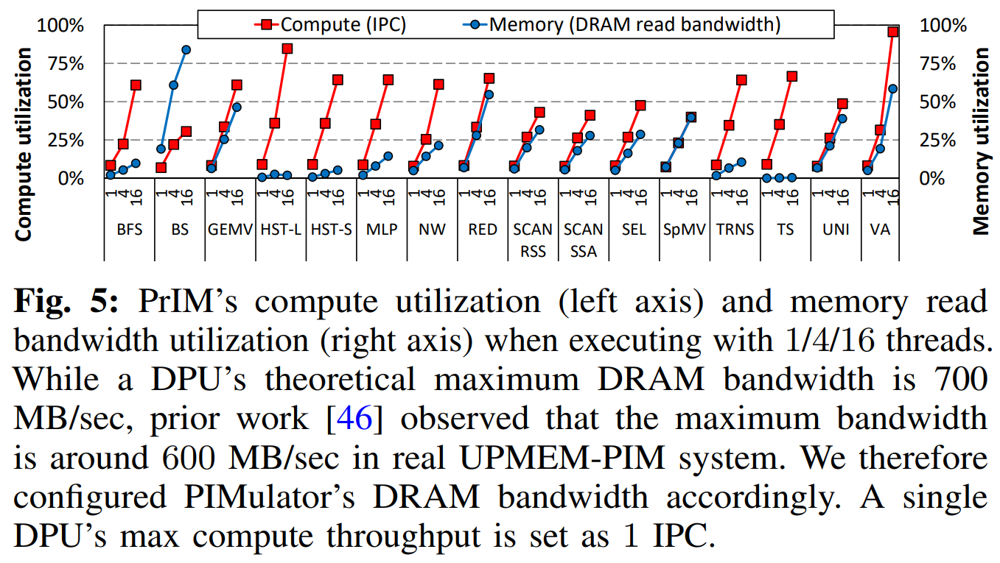
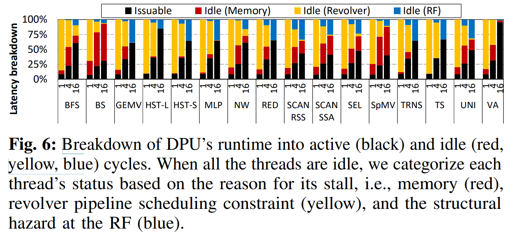
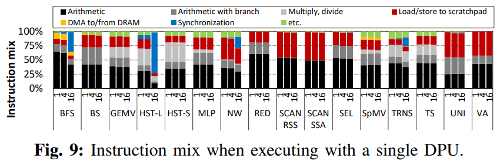
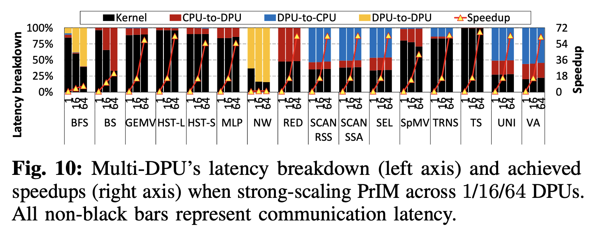

# ⚙️ Usage
## Currently Supported Mode
uPIMulator operates in an execution-driven simulation mode, enabling cycle-level performance analysis of PIM-based applications.

## Workflow
The typical usage workflow comprises two primary stages:

1. **Binary Generation:** Compile, assemble, and link your application code to generate the required binary files for simulation.
2. **Cycle-Level Simulation:** Utilize the generated binary files as input to the cycle-level simulator to obtain detailed performance metrics and insights.

We are actively working on expanding uPIMulator's capabilities and may introduce additional usage modes in future releases. 

## Installation & Build
### Prerequisites

- **Go Compiler and SDK:**  uPIMulator requires Go version 1.21.5 or higher. 
You can download and install Go from the [official website](https://go.dev/doc/install).

- **Docker:** Please ensure that Docker is installed on your system.

- **Docker Group Membership:** Your Ubuntu user account needs to be a member of the `docker` group.

- **Tested Environment:** uPIMulator has been thoroughly tested on Ubuntu 18.04 with an Intel CPU.
While we strive for compatibility across different environments, optimal performance and functionality are guaranteed within the tested setup.

### Installation Steps

1. **Install and Build**
   Navigate to the `uPIMulator` directory and execute the build script:

   ```bash
   cd /path/to/uPIMulator/golang/uPIMulator/script
   python build.py
   ```

## Binary Files Generation & Cycle-level Simulation
We will use the VA (vector addition) benchmark as an example to demonstrate the binary file generation and simulation process.
Please note that the initial simulation might take approximately 30 minutes.

### Execution
To initiate a simulation, provide the following:

- **Benchmark name:** Specify the desired benchmark (e.g., 'VA').
- **Number of tasklets:** Define the number of tasklets to be utilized.
- **Output directory path:** Indicate the absolute path to the directory where you want to store binary files, log files, and other simulation artifacts. 

You can further customize the simulation by utilizing command-line options to adjust various parameters.

### Simulation Output
Detailed simulation results will be written to the standard output (`stdout`).

> **Important Notes:**
> - **Create Output Directory:** Prior to running the simulation, create an empty directory at the specified `bin_dirpath`. 
> **Absolute Paths:**  Always provide absolute paths for both `root_dirpath` (the repository's root directory) and `bin_dirpath`.

### Example Command

```bash
cd /path/to/uPIMulator/golang/uPIMulator
rm -rf bin
mkdir bin
./build/uPIMulator --root_dirpath /path/to/uPIMulator/golang/uPIMulator --bin_dirpath /path/to/uPIMulator/golang/uPIMulator/bin --benchmark VA --num_channels 1 --num_ranks_per_channel 1 --num_dpus_per_rank 1 --num_tasklets 16 --data_prep_params 1024
```

# 📄 Reproducing Figures from the Paper
To replicate the figures presented in our paper, please adhere to the instructions provided below.
We offer replication manuals for Figures 5, 6, 7, 9 and 10 for brevity.

## Configuration of PrIM Benchmarks

- **Single DPU Focus:** For Figures 5, 6, 7, and 9 the parameters `num_channels`, `num_ranks_per_channel`, and `num_dpus_per_rank` must always be set to `1`, as these experiments specifically characterize the behavior of a single DPU.
- **Data Preparation Parameter:**  When generating the binary files for the PrIM benchmarks, please configure the `data_prep_param` parameter according to the following table:

| Benchmark | `data_prep_param` (Figures 5, 6) | `data_prep_param` (Figure 10) |
|---|---|---|
| BS       | 32768 | 131072 |
| GEMV     | 2048  | 4096   |
| HST-L    | 131072 | 524288 |
| HST-S    | 131072 | 524288 |
| MLP      | 256   | 1024   |
| RED      | 524288 | 2097152|
| SCAN-RSS | 262144 | 1048576|
| SCAN-SSA | 262144 | 1048576|
| SEL      | 524288 | 2097152|
| TRNS     | 1024  | 128    |
| TS       | 2048  | 65536  |
| UNI      | 524288 | 2097152|
| VA       | 524288 | 2097152|

### Example Command

```bash
./uPIMulator --root_dirpath /path/to/uPIMulator/ --bin_dirpath /path/to/uPIMulator/bin --benchmark VA --num_channels 1 --num_ranks_per_channel 1 --num_dpus_per_rank 1 --num_tasklets 16 --data_prep_params 524288
``` 

Please ensure you adhere to these configurations to accurately replicate the figures presented in the paper. 

## Figure 5: PrIM Compute and Memory Utilization


This figure illustrates the compute utilization (represented by red points) and memory read bandwidth utilization (represented by blue points) of the PrIM benchmarks when executed with varying numbers of threads (tasklets): 1, 4, and 16.

### Metrics Calculation

- **Compute Utilization (IPC):** `num_instructions` / `logic_cycle`
- **Memory Read Bandwidth Utilization (GB/s):** Refer to the provided Excel sheet for the calculation: [link](../assets/figure5_mem_util_calculator.xlsx)

> **Note:** The values for `num_instructions` and `logic_cycle` required in these calculations can be obtained from the simulation results generated by uPIMulator. 

## Figure 6: DPU Runtime Breakdown


This figure presents a breakdown of DPU runtime, categorizing cycles into:

- **Active Cycles (Black):** Represent cycles when the DPU is actively executing instructions.
- **Idle Cycles (Red, Yellow, Blue):** Represent cycles when the DPU is stalled due to various reasons.

### Calculation of Cycle Ratios
To generate the breakdown depicted in the figure, you can utilize the following formulas:

- **Issuable Ratio:**  `breakdown_run` / `logic_cycle`
- **Idle (Memory) Ratio:** `breakdown_dma` / `logic_cycle`
- **Idle (Revolver) Ratio:** `breakdown_etc` / `logic_cycle`
- **Idle (RF) Ratio:** `backpressure` / `logic_cycle`

> **Note:** The values for the variables used in these formulas (`breakdown_run`, `logic_cycle`, etc.) are available in the simulation results produced by uPIMulator. 

## Figure 7: Issuable Tasklets


This figure visualizes the number of tasklets (threads) that are ready for execution (issuable) by the DPU scheduler at each cycle.

### Replication
To reproduce this figure, utilize the provided [Excel sheet](../assets/figure7_active_tasklet_breakdown.xlsx).
The spreadsheet includes instructions on how to populate it with the relevant simulation output data, and it will automatically generate the corresponding figure.

> **Important Configuration Note**: Please ensure that the number of threads is configured to **16 tasklets** when running the simulations for this figure.
> You can achieve this by using the following command-line argument: `--num_tasklets 16`.

## Figure 9: Instruction Mix (Single DPU)


Figure 9 provides a breakdown of the instruction mix observed during single-DPU execution.
To generate this figure, follow the steps outlined below using the `upmem_profiler` tool and the accompanying Excel sheet.

### Procedure

1. **Build the Profiler**

   ```bash
   cd /path/to/uPIMulator/tools/upmem_profiler/script
   bash build.sh
   ```

2. **Extract Instructions**
   Run the simulation with the `--verbose 1` flag to capture detailed instruction traces.

   ```bash
   cd /path/to/uPIMulator/golang/uPIMulator/
   ./build/uPIMulator --root_dirpath /path/to/uPIMulator/golang/uPIMulator --bin_dirpath /path/to/uPIMulator/golang/uPIMulator/bin --benchmark VA --num_channels 1 --num_ranks_per_channel 1 --num_dpus_per_rank 1 --num_tasklets 16 --data_prep_params 1024 --verbose 1 > trace.txt
   ```

3. **Run the Profiler**
   Process the generated trace file using the `upmem_profiler` in `instruction_mix` mode.

   ```bash
   cd /path/to/uPIMulator/tools/upmem_profiler/
   ./build/src/upmem_profiler --logpath /path/to/uPIMulator/golang/uPIMulator/trace.txt --mode instruction_mix
   ```

4. **Generate the Figure**
   Utilize the profiler's output to populate the provided [Excel sheet](../assets/figure9_instruction_mix.xlsx), which will automatically generate the instruction mix figure.

> **Important Configuration Note:** Similar to Figure 7, the instruction mix analysis in Figure 9 is based on simulations with **16 tasklets**.
> Ensure that you maintain this configuration (`--num_tasklets 16`) for accurate replication. 

## Figure 10: Multi-DPU Latency Breakdown and Speedup


Figure 10 presents the latency breakdown and speedup achieved in multi-DPU scenarios.

### Configuring the Number of DPUs
You can adjust the number of DPUs by modifying the following parameters in `uPIMulator`:

- `num_channels` 
- `num_ranks_per_channel`
- `num_dpus_per_rank`

### Generating the Latency Breakdown
To obtain the latency breakdown data for plotting, utilize the `upmem_reg_model` tool located in the `tools/upmem_reg_model/` directory.
This tool implements a communication model between the host and DPUs based on linear regression.

### Procedure

1. **Prepare Input Excel:**
   - We provide a sample input Excel file as a template.
   - Append a new row to this file, specifying the benchmark name, number of DPUs, and the `data_prep_param` used in your simulation.
   - Fill in the relevant time values (in milliseconds) obtained from your simulation results, such as kernel execution time.
   You can convert cycle counts to time in milliseconds by dividing the cycle count by the corresponding clock frequency (in MHz) and then multiplying by 1000.

2. **Run the Regression Model:**

   ```bash
   cd /path/to/uPIMulator/tools/upmem_reg_model/src
   python main.py --input_excel_filepath /path/to/your/input_excel_file --output_excel_filepath /path/to/your/output_excel_file
   ```

3. **Access the Output:** 
   - The linear regression results will be available in the specified output Excel file.
   - Use this data to create the latency breakdown plots as shown in Figure 10.

Please ensure that you follow these steps carefully to accurately reproduce the multi-DPU latency breakdown and speedup analysis presented in the paper.

# 🌋 Adding Custom Benchmarks
uPIMulator empowers you to go beyond the provided PrIM benchmark suite by incorporating your own custom benchmarks.
This is particularly beneficial if you have access to UPMEM-PIM hardware and want to evaluate your code's performance in a simulated environment.

## Requirements
To successfully integrate a new benchmark, ensure it adheres to the following:

1. **UPMEM-C Language:**  The benchmark must be implemented in UPMEM-C, a C-like language tailored for UPMEM-PIM programming.
Consult the [UPMEM SDK documentation](https://sdk.upmem.com/2021.4.0/) for detailed programming guidelines.

2. **File Structure and Naming:**  
   - Maintain the same file hierarchy as the PrIM benchmarks, including a `dpu` subdirectory.
   - Include a `CMakeLists.txt` file within your benchmark's directory hierarchy, mirroring the structure used in the PrIM examples.
   This is essential as uPIMulator's interpreter and linker automatically detect and compile benchmarks using these `CMakeLists.txt` files.

## Data Preparation
Since UPMEM PIM-enabled memory directly utilizes physical addresses and uPIMulator currently doesn't support concurrent execution of host and PIM-enabled memory, exercise caution when feeding input/output data. 

You'll need to provide Go source code to handle data preparation for your benchmark.
This script should reside in the `uPIMulator/src/assembler` directory and be recognized by `uPIMulator/src/assembler/assembler.go`.

> **Key Considerations for Data Preparation Scripts**
> - Data transferred from the host to DPUs using `dpu_push_xfer` must be organized within the `input_dpu_mram_heap_pointer_name` variable in your data preparation script.
> - Similarly, data transferred from DPUs to the host using `dpu_push_xfer` should be placed within the `output_dpu_mram_heap_pointer_name` variable.

## Reference Examples
We have included data preparation scripts for the 13 supported PrIM benchmarks.
These serve as excellent references for structuring your custom data preparation scripts.

By following these guidelines, you can seamlessly integrate your benchmarks into uPIMulator for comprehensive performance evaluation and analysis. 

If you have any questions or encounter any difficulties during the integration process, don't hesitate to reach out to us for support. 
