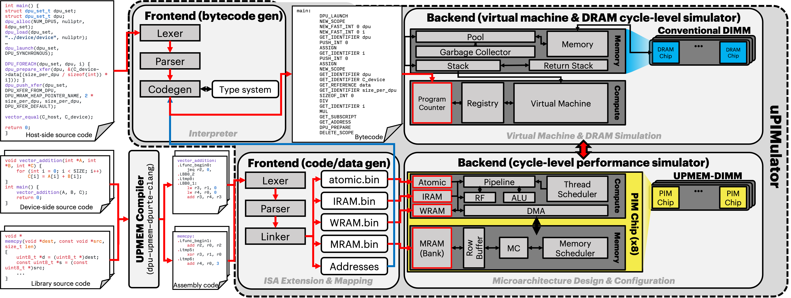

# ⚙️ Install & Build
## Usage Mode
uPIMulator currently operates in an execution-driven mode.
The typical workflow involves the following steps:

1. **Compilation and Linking:** Compile and link your application code to generate device-side binary files.
2. **Host-Side Interpretation:** The host-side virtual machine interprets the host code, orchestrating interactions with the device-side cycle-level simulator.
3. **Simulation and Results:** The simulator executes the device-side binary and provides detailed cycle-level simulation results.

We are actively exploring new usage modes and features to enhance uPIMulator's flexibility.

## Prerequisites
- Go Compiler: uPIMulator requires Go version 1.21.5 or higher.
You can download and install Go from the [official website](https://go.dev/doc/install).

- Docker: Please ensure that Docker is installed on your system.

    - Docker Group Membership: Your Ubuntu user account needs to be a member of the docker group.

- Tested Environment: uPIMulator has been thoroughly tested on Ubuntu 18.04 with an Intel CPU. 
While we strive for compatibility across different environments, optimal performance and functionality are ensured within the tested setup.

Please let us know if you encounter any issues in other environments. 
We appreciate your feedback as we continue to improve and expand uPIMulator's compatibility.

## Install
```bash
cd /path/to/uPIMulator/script

python3 build.py
```

### Verification
Upon successfully installing and building, the uPIMulator executable will be located in the `/path/to/uPIMulator/build` directory.

Please ensure that you replace `/path/to/uPIMulator` with the actual path where you cloned or downloaded the uPIMulator repository.

If you encounter any difficulties during the installation or build process, or if the executable is not found in the expected location, please refer to the troubleshooting section of the documentation or feel free to open an issue on our GitHub repository.

# 🧪 Running the PrIM Benchmark Suite
## Validation with PrIM Benchmark Suite
uPIMulator's accuracy and functionality have been validated using PrIM, an open-source UPMEM-PIM benchmark suite comprising 16 data-intensive workloads across diverse application domains (linear algebra, graph processing, neural networks, etc.).

Among the 16 benchmarks, uPIMulator successfully simulates 13 without modifications. The remaining three (BFS, SpMV, NW) presented challenges due to minor bugs or their reliance on undisclosed UPMEM SDK functions, hindering their simulation and debugging within uPIMulator. Consequently, these three benchmarks are currently excluded from the exemplar benchmarks provided in this repository.

We are actively working to address these limitations and expand uPIMulator's compatibility with the full PrIM benchmark suite in future releases.

## Running a Simulation
We'll use the VA (vector addition) benchmark to illustrate the simulation process.
Please note that the initial simulation might take approximately 30 minutes.

### Execution
To initiate a simulation, provide the following:

- **Benchmark name:** Specify the desired benchmark (e.g., `VA`).
- **Number of tasklets:** Define the number of tasklets to be utilized.
- **Output directory path:** Indicate the absolute path to the directory where you want to store binary files, log files, and other simulation artifacts. 

You can further customize the simulation by utilizing command-line options to adjust various parameters.

### Simulation Output
Detailed simulation results will be written to `/path/to/bin/log.txt`.

> **Note:** Be sure to replace `/path/to/bin` with the absolute path to your chosen output directory.

### Important Notes
- **Create Output Directory:** Prior to running the simulation, create an empty directory at the specified `bin_dirpath`. 
- **Absolute Paths:**  Always provide absolute paths for both `root_dirpath` (the repository's root directory) and `bin_dirpath`.

```bash
cd /path/to/uPIMulator

rm -rf bin

mkdir bin

./build/uPIMulator --root_dirpath /path/to/uPIMulator --bin_dirpath /path/to/uPIMulator/bin --benchmark VA --num_channels 1 --num_ranks_per_channel 1 --num_dpus_per_rank 1 --num_tasklets 16 --data_prep_params 1024
```

Feel free to experiment with different benchmarks and configurations to explore uPIMulator's capabilities.

# 🗒️ List of Parameters and Logs
## Configuration and Output
The uPIMulator framework offers flexibility through command-line arguments and generates a log.txt file to present comprehensive simulation results.
This documentation provides detailed explanations for each parameter and the structure of the log output, aiding in understanding and interpreting the simulation data.

## 🪂 Parameters
### Parameter Types
uPIMulator utilizes two distinct parameter categories:

- **Command-Line Parameters:** The `CommandLineParser` struct processes command-line arguments, configuring both the host-side virtual machine and the device-side UPMEM-PIM simulator before simulation commences.
These parameters directly influence the simulation setup and execution.

- **Configuration Parameters:** The `ConfigLoader` struct manages additional parameters that are less likely to affect the simulation results directly. 
These may include settings like IRAM address offsets or MRAM size, primarily influencing the simulated environment's configuration.

| Command Line Arguments | Meaning |
| --- | --- |
| verbose | Runtime simulation status monitoring level (0: no monitoring, 1: restricted monitoring, 2: full monitoring) |
| benchmark | Benchmark name |
| num_channels | Number of PIM memory channels |
| num_ranks_per_channel | Number of ranks per PIM memory channel |
| num_dpus_per_rank | Number of DPUs per PIM memory rank |
| num_vm_channels | Number of conventional memory channels attached to the host |
| num_vm_ranks_per_channel | Number of ranks per conventional memory channel attached to the host |
| num_vm_banks_per_rank | Number of DRAM banks per conventional memory rank attached to the host |
| num_tasklets | Number of tasklets per DPU when running the benchmark |
| data_prep_params | Value that configures the input size of the benchmark |
| root_dirpath | Absolute path to the root directory of uPIMulator |
| bin_dirpath | Absolute path to the bin directory where binary files and log files are dumped |
| logic_frequency | DPU logic frequency in MHz |
| memory_frequency | Operating frequency of PIM and conventional memory |
| num_pipeline_stages | Number of DPU logic pipeline stages |
| num_revolver_scheduling_cycles | Number of DPU logic revolver scheduling cycles in DPU's logic operating frequency |
| wordline_size | Row buffer size per single DPU's MRAM and conventional DRAM bank in bytes |
| min_access_granularity | Minimum access granularity in bytes of DPU's MRAM and conventional DRAM's bank |
| t_rcd | t_RCD timing parameter of DPU's MRAM and conventional DRAM's bank in cycles in memory operating frequency |
| t_ras | t_RAS timing parameter of DPU's MRAM and conventional DRAM's bank in cycles in memory operating frequency |
| t_rp | t_RP timing parameter of DPU's MRAM and conventional DRAM's bank in cycles in memory operating frequency |
| t_cl | t_CL timing parameter of DPU's MRAM and conventional DRAM's bank in cycles in memory operating frequency |
| t_bl | t_BL timing parameter of DPU's MRAM and conventional DRAM's bank in cycles in memory operating frequency |

| ConfigLoader Parameters | Meaning |
| --- | --- |
| AddressWidth | Bit width of all addresses (e.g., 32-bit machine or 64-bit machine) |
| AtomicDataWidth | DPU's atomic region's bit width of all data |
| AtomicOffset | Offset address of DPU's atomic region in DPU's physical address space |
| AtomicSize | Size in bytes of DPU's atomic region |
| IramDataWidth | DPU's IRAM's bit width of all data |
| IramOffset | Offset address of DPU's IRAM in DPU's physical address space |
| IramSize | Size in bytes of DPU's IRAM |
| WramDataWidth | DPU's WRAM's bit width of all data |
| WramOffset | Offset address of DPU's WRAM in DPU's physical address space |
| WramSize | Size in bytes of DPU's WRAM |
| MramDataWidth | DPU's MRAM's bit width of all data |
| MramOffset | Offset address of DPU's MRAM in DPU's physical address space |
| MramSize | Size in bytes of DPU's MRAM |
| StackSize | A single DPU's stack size in bytes for each tasklet |
| HeapSize | A single DPU's heap size in bytes |
| NumGpRegisters | Number of general-purpose registers of a single DPU's each tasklet |
| MaxNumTasklets | Max number of tasklets per each DPU |
| VmBankOffset | Offset address of each bank of the virtual machine interpreting host-side benchmark code |
| VmBankSize | Size in bytes of the virtual machine's each bank |
| VmBg0 | Bit location of the first bank group bit for the virtual machine's DRAM address mapping |
| VmBg1 | Bit location of the second bank group  bit for the virtual machine's DRAM address mapping |
| VmBank | Bit locations of the bank  bits for the virtual machine's DRAM address mapping |
| VmMemorySize | Initial memory size of the virtual machine |
| GarbageCollectionThreshold | Number of bytecode executed before starting garbage collection in the virtual machine |

## 🪵 Logs
## Simulation Logging
- **Log Storage and Output:** uPIMulator temporarily stores simulation logs within the `StatFactory` struct.
Upon completion, these logs are written to a file named `log.txt` located in the designated `bin` directory. 

- **Custom Log Monitoring:** To track additional simulation behaviors, you can extend the `StatFactory` struct to include new log entries.
Ensure that these new entries are incorporated into the `Dump` function within the `System` struct to facilitate their inclusion in the final log output. 

| Logs | Meaning |
| --- | --- |
| ThreadScheduler[X_Y_Z]_breakdown_etc | Number of DPU logic cycles of the DPU not being able to issue an instruction due to revolver pipeline in the DPU with channel ID of X, rank ID of Y, and DPU ID of Z |
| ThreadScheduler[X_Y_Z]_breakdown_run | Number of DPU logic cycles of the DPU being able to issue an instruction in the DPU with channel ID of X, rank ID of Y, and DPU ID of Z |
| ThreadScheduler[X_Y_Z]_breakdown_dma | Number of DPU logic cycles of the DPU not being able to issue an instruction due to data is not ready from MRAM in the DPU with channel ID of X, rank ID of Y, and DPU ID of Z |
| Logic[X_Y_Z]_backpressure | Number of DPU logic cycles of the DPU not being able to issue an instruction due to register file conflicts in the DPU with channel ID of X, rank ID of Y, and DPU ID of Z |
| Logic[X_Y_Z]_active_tasklets_N | Number of DPU logic cycles when number of N tasklets are active in the DPU with channel ID of X, rank ID of Y, and DPU ID of Z |
| Logic[X_Y_Z]_logic_cycle | Number of DPU logic cycles elapsed during PIM kernel execution in the DPU with channel ID of X, rank ID of Y, and DPU ID of Z |
| Logic[X_Y_Z]_num_instructions | Number of instructions executed by the DPU with channel ID of X, rank ID of Y, and DPU ID of Z |
| CycleRule[X_Y_Z]_cycle_rule | Total number of DPU logic cycles resolving register file conflicts for all threads in the DPU with channel ID of X, rank ID of Y, and DPU ID of Z |
| MemoryController[X_Y_Z]_memory_cycle | Number of MRAM memory cycles ticked in the DPU with channel ID of X, rank ID of Y, and DPU ID of Z |
| MemoryScheduler[X_Y_Z]_num_fr | Number of reordered memory commands thanks to FR-FCFS memory scheduling policy in the DPU with channel ID of X, rank ID of Y, and DPU ID of Z |
| MemoryScheduler[X_Y_Z]_num_fcfs | Number of non-reordered memory commands in the DPU with channel ID of X, rank ID of Y, and DPU ID of Z |
| RowBuffer[X_Y_Z]_num_activations | Number of ACTIVATION memory commands received by the DPU with channel ID of X, rank ID of Y, and DPU ID of Z |
| RowBuffer[X_Y_Z]_num_precharges | Number of PRECHARGE memory commands received by the DPU with channel ID of X, rank ID of Y, and DPU ID of Z |
| RowBuffer[X_Y_Z]_num_reads | Number of READ memory commands received by the DPU with channel ID of X, rank ID of Y, and DPU ID of Z |
| RowBuffer[X_Y_Z]_num_writes | Number of WRITE memory commands received by the DPU with channel ID of X, rank ID of Y, and DPU ID of Z |
| RowBuffer[X_Y_Z]_read_bytes | Total number of bytes read by the DPU with channel ID of X, rank ID of Y, and DPU ID of Z |
| RowBuffer[X_Y_Z]_write_bytes | Total number of bytes written by the DPU with channel ID of X, rank ID of Y, and DPU ID of Z |
| VmBank[X_Y_Z]_vm_memory_cycle | Number of host-side conventional DRAM memory cycles ticked by the DRAM bank with channel ID of X, rank ID of Y, and bank ID of Z |
| MemoryScheduler_num_fr | Number of reordered memory commands thanks to FR-FCFS memory scheduling policy in the host-attached memory controller in the virtual machine |
| MemoryScheduler_num_fcfs | Number of non-reordered memory commands in the host-attached memory controller in the virtual machine |
| VmRowBuffer[X_Y_Z]_num_activations | Number of ACTIVATION memory commands received by the virtual machine's DRAM bank with channel ID of X, rank ID of Y, and bank ID of Z |
| VmRowBuffer[X_Y_Z]_num_precharges | Number of PRECHARGE memory commands received by the virtual machine's DRAM bank with channel ID of X, rank ID of Y, and bank ID of Z |
| VmRowBuffer[X_Y_Z]_num_reads | Number of READ memory commands received by the virtual machine's DRAM bank with channel ID of X, rank ID of Y, and bank ID of Z |
| VmRowBuffer[X_Y_Z]_num_writes | Number of WRITE memory commands received by the virtual machine's DRAM bank with channel ID of X, rank ID of Y, and bank ID of Z |
| VmRowBuffer[X_Y_Z]_read_bytes | Total number of bytes read by the virtual machine's DRAM bank with channel ID of X, rank ID of Y, and bank ID of Z |
| VmRowBuffer[X_Y_Z]_write_bytes | Total number of bytes written by the virtual machine's DRAM bank with channel ID of X, rank ID of Y, and bank ID of Z |

# 🪑 Benchmark Addition
## Adding Custom Benchmarks
In addition to the provided PrIM benchmarks, uPIMulator allows you to integrate your own benchmarks, especially if you have access to UPMEM-PIM hardware and your code runs successfully on the actual device.

To incorporate your benchmark, you'll need to adapt your codebase to a format that uPIMulator's virtual machine can interpret. Detailed guidance on this process can be found in the **"Interpretable C Grammar"** section within this documentation.

To add a custom benchmark beyond the existing PrIM suite, adhere to the following guidelines:

1. **Benchmark Location:** Place your new benchmark within the `benchmark` directory.

2. **UPMEM-C Language:** The benchmark code must be written in UPMEM-C, a modified C language specifically designed for UPMEM-PIM programming, similar to CUDA for NVIDIA GPUs. Refer to the UPMEM SDK documentation for comprehensive instructions on the UPMEM programming model.

3. **File Structure and Naming:** Maintain the same file hierarchy and naming conventions used in the PrIM benchmarks (e.g., `VA/host/app.c` and `VA/dpu/task.c`).

4. **CMakeLists.txt:** Include a `CMakeLists.txt` file within your benchmark's directory hierarchy, mirroring the structure used in the PrIM examples.
This is essential as uPIMulator's interpreter and linker automatically detect and compile benchmarks using these `CMakeLists.txt` files.

> **Note:** These structural requirements ensure seamless integration with uPIMulator's build and execution processes.

# 🏊 Delving into the Host-side Virtual Machine
## Host-Side Virtual Machine and Interpretable C Grammar
The host-side virtual machine interprets host-side code written in a subset of C, eliminating the need for manual input/output data preparation.

## Interpretable C Grammar
uPIMulator's interpreter, responsible for generating bytecode for the virtual machine, consists of three components: the lexer, the parser, and the code generator.

### Supported Data Types
- `char`
- `short`
- `int`
- `long` (64-bit integers in the uPIMulator's virtual machine)

### Limitations and Exceptions
While the interpreter strives to handle standard C grammar, certain features are currently unsupported due to the virtual machine's constraints:

- **Comments:** Any kind of comments (`//` or `/* */`) are not allowed.
- **Header Files:** Including header files will be ignored.
- **Linking:** The host-side virtual machine does not support linking.
All code must reside in a single file named `app.c` within the benchmark directory.
- **`#define` Directives:**
    - `#define NUM_DPUS`, `#define NUM_TASKLETS`, and `#define DATA_PREP_PARAMS` will be replaced with their corresponding command-line arguments (i.e., `--num_dpus`, `--num_tasklets`, `--data_prep_params`).
    - Other `#define` directives will have their right-hand side (rvalue) evaluated and assigned.
    The rvalue must be a single number.
- **Macro Functions:** Macro functions are not permitted.
- **Conditional Compilation:** Constructs like `#if`, `#ifdef`, etc., are not supported.
- **Data Types and Keywords:**
    - `bool`, `static`, `unsigned`, `union`, `enum`, `const`, and `typedef` keywords are not supported.
- **Struct Initialization:** 
    - Struct variables must be initialized using `malloc` (e.g., `struct foo_t bar = malloc(sizeof(struct foo_t));`).
    - `sizeof` expressions cannot infer variable types by name.
    - Direct struct initialization (e.g., `struct foo_t bar = {1, 2};`) is not supported.
- **Expressions and Operators:**
    - Assignment statements (`a = 2`) and increment/decrement operators (`i++`, `--j`) do not evaluate to expressions.
    - The virtual machine evaluates all expressions, even in short-circuit logical operations (e.g., both `expr_a` and `expr_b` will be evaluated in `expr_a || expr_b`, even if `expr_a` is true).
- **Other Restrictions:**
    - Array declarations (`int a[10];`) and `switch-case` statements are not allowed.
    - Nested pointers (`int** p;`) and pointer arithmetic (`p + 1`) are not supported.
    - Curly braces are mandatory for control flow structures (e.g., `if (foo) bar();` is invalid).
    - Type casting (e.g., `(int *) p`) is not permitted.
    - The `main` function should not have any arguments (`int main() {...}`).
    - Standard library calls, except for `malloc` and `free`, are not supported (e.g., `printf` cannot be used).
    - Only the following UPMEM SDK library functions are supported: `dpu_alloc`, `dpu_load`, `dpu_prepare`, `dpu_push_xfer`, `dpu_copy_to`, `dpu_copy_from`, `dpu_launch`, and `dpu_free`.
    - `float` and `double` types are not supported.

Please adhere to these guidelines when writing host-side code for uPIMulator. We are continuously working to expand the supported C grammar and features in future releases.

## 🏗️ Virtual Machine Overview


### Host-Side Interpreter and Virtual Machine Architecture
uPIMulator employs a streamlined host-side interpreter and virtual machine to facilitate the interpretation of C code.
While this approach offers benefits in terms of simplicity and ease of use, it also entails certain limitations, as outlined in the **"Interpretable C Grammar"** section above.
Consequently, some modifications to your host-side C code may be necessary to ensure compatibility with uPIMulator's interpreter and virtual machine.

### Interpreter
The interpreter follows a three-stage process to generate bytecode, which is subsequently executed by the virtual machine:

1. **Lexical Analysis (Lexer):**  The lexer breaks down the C source code into a stream of tokens.

2. **Syntax Analysis (Parser):**  The parser constructs an Abstract Syntax Tree (AST) from the token stream, representing the code's structure.

3. **Code Generation (Codegen):**  The codegen translates the AST into bytecode instructions for the virtual machine.

> **Note:** The interpreter currently lacks type checking capabilities.
> To ensure type safety, we strongly recommend utilizing a C compiler (such as GCC) to identify any compilation errors before attempting simulation with uPIMulator.

### Virtual Machine
The virtual machine executes the generated bytecode sequentially, similar to other virtual machines like the Java Virtual Machine (JVM) or Python Virtual Machine.
It operates using a stack-based architecture, where data is manipulated on the stack rather than in registers.

A basic mark-and-sweep garbage collector is implemented within the virtual machine. We are actively exploring enhancements to the garbage collection and memory management mechanisms to further optimize performance.

We are committed to ongoing development and improvement of the interpreter and virtual machine to provide a more robust and efficient simulation environment.

### 💿 Bytecode
#### Bytecode and Data Types
- **Bytecode:** Bytecode serves as the fundamental instruction set for the virtual machine, representing the compiled form of the host-side C code.
- **Data Types:** Within the virtual machine environment, the long data type is represented as an 8-byte integer.

| Bytecode | Meaning | Arg1 | Arg2 | Str1 | Str2 |
| --- | --- | --- | --- | --- | --- |
| NEW_SCOPE | Creates a new scope that stores symbols for the new block statement |  |  |  |  |
| DELETE_SCOPE | Deletes the last scope when exiting a block statement |  |  |  |  |
| PUSH_CHAR | Push a char type or char type pointer object onto the stack | Value |  |  |  |
| PUSH_SHORT | Push a short type or short type pointer object onto the stack | Value |  |  |  |
| PUSH_INT | Push an int type or int type pointer object onto the stack | Value |  |  |  |
| PUSH_LONG | Push a long type or long type pointer object onto the stack | Value |  |  |  |
| PUSH_STRING | Push a string type or string type pointer object onto the stack |  |  | Characters |  |
| POP | Pop an object from the stack |  |  |  |  |
| BEGIN_STRUCT | Start registering a custom data structeure (i.e., C struct), aka skeleton, to the virtual machine's registry |  |  | struct type name |  |
| APPEND_VOID | Append a void type or void type pointer field to the recently registered skeleton | Number of stars (i.e., *) |  | Field name |  |
| APPEND_CHAR | Append a char type or char type pointer field to the recently registered skeleton | Number of stars (i.e., *) |  | Field name |  |
| APPEND_SHORT | Append a short type or short type pointer field to the recently registered skeleton | Number of stars (i.e., *) |  | Field name |  |
| APPEND_INT | Append an int type or int type pointer field to the recently registered skeleton | Number of stars (i.e., *) |  | Field name |  |
| APPEND_LONG | Append a long type or long type pointer field to the recently registered skeleton | Number of stars (i.e., *) |  | Field name |  |
| APPEND_STRUCT | Append a struct type or struct type pointer field to the recently registered skeleton | Number of stars (i.e., *) |  | Field's struct type name | Field name |
| END_STRUCT | End registering a skeleton to the virtual machine's registry |  |  |  |  |
| NEW_GLOBAL_VOID | Creates a void type or void type pointer global symbol in the global scope | Number of stars (i.e., *) |  | Identifier name |  |
| NEW_GLOBAL_CHAR | Creates a char type or char type pointer global symbol in the global scope | Number of stars (i.e., *) |  | Identifier name |  |
| NEW_GLOBAL_SHORT | Creates a short type or short type pointer global symbol in the global scope | Number of stars (i.e., *) |  | Identifier name |  |
| NEW_GLOBAL_INT | Creates an int type or int type pointer global symbol in the global scope | Number of stars (i.e., *) |  | Identifier name |  |
| NEW_GLOBAL_LONG | Creates a long type or long type pointer global symbol in the global scope | Number of stars (i.e., *) |  | Identifier name |  |
| NEW_FAST_VOID | Creates a void type or void type pointer fast (i.e., local) symbol in the fast scope | Number of stars (i.e., *) |  | Identifier name |  |
| NEW_FAST_CHAR | Creates a char type or char type pointer fast (i.e., local) symbol in the fast scope | Number of stars (i.e., *) |  | Identifier name |  |
| NEW_FAST_SHORT | Creates a short type or short type pointer fast (i.e., local) symbol in the fast scope | Number of stars (i.e., *) |  | Identifier name |  |
| NEW_FAST_INT | Creates an int type or int type pointer fast (i.e., local) symbol in the fast scope | Number of stars (i.e., *) |  | Identifier name |  |
| NEW_FAST_LONG | Creates a long type or long type pointer fast (i.e., local) symbol in the fast scope | Number of stars (i.e., *) |  | Identifier name |  |
| NEW_FAST_STRUCT | Creates a struct type or struct type pointer fast (i.e., local) symbol in the fast scope | Number of stars (i.e., *) |  | struct type name | Identifier name |
| NEW_ARG_VOID | Creates a void type or void type pointer argument symbol in the argument scope upon function call | Number of stars (i.e., *) |  | Identifier name |  |
| NEW_ARG_CHAR | Creates a char type or char type pointer argument symbol in the argument scope upon function call | Number of stars (i.e., *) |  | Identifier name |  |
| NEW_ARG_SHORT | Creates a short type or short type pointer argument symbol in the argument scope upon function call | Number of stars (i.e., *) |  | Identifier name |  |
| NEW_ARG_INT | Creates an int type or int type pointer argument symbol in the argument scope upon function call | Number of stars (i.e., *) |  | Identifier name |  |
| NEW_ARG_LONG | Creates a long type or long type pointer argument symbol in the argument scope upon function call | Number of stars (i.e., *) |  | Identifier name |  |
| NEW_ARG_STRUCT | Creates a struct type or struct type pointer argument symbol in the argument scope upon function call | Number of stars (i.e., *) |  | struct type name | Identifier name |
| NEW_RETURN_VOID | Creates a void type or void type pointer in the return stack upon function return | Number of stars (i.e., *) |  |  |  |
| NEW_RETURN_CHAR | Creates a char type or char type pointer in the return stack upon function return | Number of stars (i.e., *) |  |  |  |
| NEW_RETURN_SHORT | Creates a short type or short type pointer in the return stack upon function return | Number of stars (i.e., *) |  |  |  |
| NEW_RETURN_INT | Creates a int type or int type pointer in the return stack upon function return | Number of stars (i.e., *) |  |  |  |
| NEW_RETURN_LONG | Creates a long type or long type pointer in the return stack upon function return | Number of stars (i.e., *) |  |  |  |
| NEW_RETURN_STRUCT | Creates a struct type or struct type pointer in the return stack upon function return | Number of stars (i.e., *) |  |  |  |
| SIZE_OF_VOID | Push the size of the void type or void type pointer on the stack | Number of stars (i.e., *) |  |  |  |
| SIZE_OF_CHAR | Push the size of the char type or char type pointer on the stack | Number of stars (i.e., *) |  |  |  |
| SIZE_OF_SHORT | Push the size of the short type or short type pointer on the stack | Number of stars (i.e., *) |  |  |  |
| SIZE_OF_INT | Push the size of the int type or int type pointer on the stack | Number of stars (i.e., *) |  |  |  |
| SIZE_OF_LONG | Push the size of the long type or long type pointer on the stack | Number of stars (i.e., *) |  |  |  |
| SIZE_OF_STRUCT | Push the size of the struct type or struct type pointer on the stack | Number of stars (i.e., *) |  | struct type name |  |
| GET_IDENTIFIER | Push the object of the symbol from global or fast scopes with identifier name on the stack |  |  | Identifier name |  |
| GET_ARG_IDENTIFIER | Push the object of the symbol from argument scope with identifier name on the stack |  |  | Identifier name |  |
| GET_SUBSCRIPT | Push an object of an array item on the stack |  |  |  |  |
| GET_ACCESS | Push an object of a skeleton's field on the stack |  |  |  |  |
| GET_REFERENCE | Push an object of a pointer to skeleton's field on the stack |  |  |  |  |
| GET_ADDRESS | Push an address of an object on the stack |  |  |  |  |
| GET_VALUE | Push reference of an object on the stack |  |  |  |  |
| ALLOC | Allocates an object when calling C malloc function |  |  |  |  |
| FREE | Deallocates an object when calling C free function |  |  |  |  |
| ASSERT | Assert if the top of stack item is zero |  |  |  |  |
| ADD | Add two stack items on the top and push the result on the stack |  |  |  |  |
| SUB | Substract two stack items on the top and push the result on the stack |  |  |  |  |
| MUL | Multiplicate two stack items on the top and push the result on the stack |  |  |  |  |
| DIV | Divide two stack items on the top and push the result on the stack |  |  |  |  |
| MOD | Conduct a modular operation for two stack items on the top and push the result on the stack |  |  |  |  |
| LSHIFT | Conduct a shift-to-the-left operation for two stack items on the top and push the result on the stack |  |  |  |  |
| RSHIFT | Conduct a shift-to-the-right operation for two stack items on the top and push the result on the stack |  |  |  |  |
| NEGATE | Conduct a logical not operation for top of the stack item on the top and push the result on the stack |  |  |  |  |
| TILDE | Conduct a bitwise not operation for top of the stack item on the top and push the result on the stack |  |  |  |  |
| SQRT | Conduct a square root operation for top of the stack item on the top and push the result on the stack |  |  |  |  |
| BITWISE_AND | Conduct a bitwise and operation for two stack items on the top and push the result on the stack |  |  |  |  |
| BITWISE_XOR | Conduct a bitwise xor operation for two stack items on the top and push the result on the stack |  |  |  |  |
| BITWISE_OR | Conduct a bitwise or operation for two stack items on the top and push the result on the stack |  |  |  |  |
| LOGICAL_AND | Conduct a logical and operation for two stack items on the top and push the result on the stack |  |  |  |  |
| LOGICAL_OR | Conduct a logical xor operation for two stack items on the top and push the result on the stack |  |  |  |  |
| LOGICAL_NOT | Conduct a logical not operation for top of the stack item on the top and push the result on the stack |  |  |  |  |
| EQ | Conduct an equality operation for two stack items on the top and push the result on the stack |  |  |  |  |
| NOT_EQ | Conduct an not-equality operation for two stack items on the top and push the result on the stack |  |  |  |  |
| CONDITIONAL | Conduct a conditional operation for three stack items on the top and push the result on the stack |  |  |  |  |
| ASSIGN | Assign the value of object of the top of the stack to the object in the second to the top of the stack |  |  |  |  |
| ASSIGN_STAR | Conduct a multiplication operation for two stack items on the top and assign the value to the object in the second top of the stack |  |  |  |  |
| ASSIGN_DIV | Conduct a division operation for two stack items on the top and assign the value to the object in the second top of the stack |  |  |  |  |
| ASSIGN_MOD | Conduct a modular operation for two stack items on the top and assign the value to the object in the second top of the stack |  |  |  |  |
| ASSIGN_ADD | Conduct an addition operation for two stack items on the top and assign the value to the object in the second top of the stack |  |  |  |  |
| ASSIGN_SUB | Conduct a substraction operation for two stack items on the top and assign the value to the object in the second top of the stack |  |  |  |  |
| ASSIGN_LSHIFT | Conduct a shift-to-the-left operation for two stack items on the top and assign the value to the object in the second top of the stack |  |  |  |  |
| ASSIGN_RSHIFT | Conduct a shift-to-the-right operation for two stack items on the top and assign the value to the object in the second top of the stack |  |  |  |  |
| ASSIGN_BITWISE_AND | Conduct a bitwise and operation for two stack items on the top and assign the value to the object in the second top of the stack |  |  |  |  |
| ASSIGN_BITWISE_XOR | Conduct a bitwise xor operation for two stack items on the top and assign the value to the object in the second top of the stack |  |  |  |  |
| ASSIGN_BITWISE_OR | Conduct a bitwise or operation for two stack items on the top and assign the value to the object in the second top of the stack |  |  |  |  |
| ASSIGN_PLUS_PLUS | Increment by one of the stack item on the top and assign the value to the object |  |  |  |  |
| ASSIGN_MINUS_MINUS | Decrement by one of the stack item on the top and assign the value to the object |  |  |  |  |
| ASSIGN_RETURN | Assign the value of the object in the top of the stack to the stack item on the top of the return stack |  |  |  |  |
| JUMP | Jump to a label by changing the program counter (PC) |  |  | label name |  |
| JUMP_IF_ZERO | Jump to a label if the value on the top of the stack is zero by changing the program counter (PC) |  |  |  |  |
| JUMP_IF_NONZERO | Jump to a label if the value on the top of the stack is non-zero by changing the program counter (PC) |  |  |  |  |
| CALL | Call a function by changing the program counter (PC) and pass function arguments |  |  |  |  |
| RETURN | Return from a function and pass the value from return stack to the stack if exists |  |  |  |  |
| NOP | Do nothing |  |  |  |  |
| DPU_ALLOC | Allocate a single DPU | DPU ID |  |  |  |
| DPU_LOAD | Load PIM kernel to the allocated DPUs | DPU ID |  | Benchmark name |  |
| DPU_PREPARE | Prepare for a data transfer between the virtual machine and DPUs |  |  |  |  |
| DPU_TRANSFER | Transfer the prepared data between the virtual machine and DPUs |  |  |  |  |
| DPU_LAUNCH | Launch the loaded PIM kernel to the allocated DPUs |  |  |  |  |
| DPU_FREE | Deallocate DPUs |  |  |  |  |

### 🧠 Memory Management in uPIMulator's Virtual Machine
uPIMulator's virtual machine employs a dynamic memory management system to handle objects, arenas, and data transfers within the simulated environment.

#### Key Components
- **Object:** The fundamental unit of memory, representing a typed data entity with an address and size.
- **Arena:** Manages the allocation and deallocation of objects using a pool structure. 
    - **Pool:** Maintains a list of objects and provides allocation/deallocation functionalities.
    Currently employs a best-fit algorithm for allocation, which we plan to optimize for improved efficiency.
    - **Arena:**  Provides wrapper functions for `Pool` operations, such as `NewInt` for allocating and initializing integer objects.
- **Memory:** A byte stream storing the actual data for all objects, with `Read` and `Write` APIs for data access.
- **PC (Program Counter):**  Tracks the current execution point within the bytecode for each encountered label.
- **Stack and Return Stack:** 
    - **Stack:** Maintains a stack of `StackItem` structs, each encapsulating a `TypeVariable` (specifying the data type), address, and size.
    - **Return Stack:** Similar to the stack, but specifically used for storing return values from function calls.
- **Scope:**
    - **Scope Chain:**  Manages a chain (FIFO queue) of `Scope` structs, each associating symbol names with their runtime objects.
    - **Scope Types:**
        - `global`:  Holds globally defined symbols and those defined by `#define` macros.
        - `fast`:  Stores locally defined symbols within block statements, forming a chain of fast scopes as new blocks are encountered.
        - `arg`:  Contains symbols passed as arguments during function calls, transferred to the fast scope after the call.
- **Type System:** A dynamic type system where each stack item's type is specified by a `TypeVariable`. 
Custom struct types are dynamically registered and tracked using `Skeleton` and `Registry` structs.
- **Frame:** 
    - **Frame Chain:**  Manages a chain of `Frame` structs, each created upon jumping to a new label.
    - **Frame Structure:** Encapsulates a stack, return stack, scope chain, arguments scope, and PC for managing program execution context.
- **DRAM:** Simulates the timing of host-side DRAM accesses.
Employs a channel-rank-bank hierarchy and a FR-FCFS scheduling policy.
Key components include:
    - `TransferCommand`: Encapsulates information for DMA transfers between host and device memory.
    - `MemoryController`: Translates `TransferCommand` into `MemoryCommand` sequences using `MemoryMapping` and `MemoryScheduler`.
    - `MemoryMapping`: Maps virtual machine addresses to physical DRAM locations (channel, rank, bank, bank address).
    - `MemoryScheduler`: Generates `MemoryCommand` (`ACTIVATE`, `READ`, `WRITE`, `PRECHARGE`) sequences and manages open rows.
    - `RowBuffer`: Models the timing behavior of a DRAM bank, including activation delays, read/write latencies, and precharge time.

#### Cycle Function Calls
The virtual machine invokes `Cycle` functions during data transfers between host and device memory or during PIM kernel execution. 

- **Memory Transfers:** Only the `Cycle` functions of the involved memories are called; DPU logic is not simulated.
- **PIM Kernel Execution:** The PIM memory's `Cycle` function is called throughout the entire execution, encompassing both kernel computation and data transfers.

Specific cycle counts (e.g., `Logic[X_Y_Z]_logic_cycle`, `VmBank[X_Y_Z]_vm_memory_cycle`, `MemoryController[X_Y_Z]_memory_cycle`) can be multiplied by their respective clock frequencies to estimate wall clock times.

We are continuously refining and enhancing the memory management and simulation mechanisms within uPIMulator. Please refer to the documentation for more in-depth technical details and stay tuned for future updates!

# 🏭 Delving into the Device-side UPMEM-PIM Simulator
## Device-Side UPMEM-PIM Simulator
The device-side component of uPIMulator accurately models the behavior and timing characteristics of UPMEM-PIM hardware.
This enables detailed cycle-level simulations of PIM-based computations and memory interactions, providing insights into performance and potential optimizations.

## 🏗️ UPMEM-PIM Simulator Overview


## Device-Side UPMEM-PIM Simulator
The device-side UPMEM-PIM simulator exclusively supports execution-driven simulation, employing a producer-consumer model within its hardware components. 

## Core Structure
- **Initialization and Destruction:** All hardware components are initialized using an `Init` function and deconstructed using a `Fini` function. 
- **Communication:** Components interact via `Push` and `Pop` functions to send requests (e.g., `DmaCommand`, `MemoryCommand`) and receive responses, utilizing corresponding queue structures (e.g., `DmaCommandQ`, `MemoryCommandQ`). 
- **Cycle-Level Simulation:** Each component possesses a `Cycle` function defining its single-cycle behavior.
Parent components invoke the `Cycle` functions of their child components (e.g., `MemoryController` calls `RowBuffer`'s `Cycle` function).

## Key Components
### Compiler
The simulator's compiler utilizes a Docker container to compile benchmark code and the UPMEM SDK using `dpu-upmem-dpurte-clang`, generating assembly code for the linker.

### Linker
The linker comprises three stages:

1. **Lexer:** Converts UPMEM assembly source code into a token stream.
2. **Parser:**  Transforms the token stream into an Abstract Syntax Tree (AST).
3. **Logic:**  Implements four algorithms guided by the linker script (`uPIMulator/sdk/misc/dpu.lds`) to determine memory assignments for code sections. 
    - **Liveness Analysis (`LivenessAnalyzer`):**  Analyzes the AST to establish linking relationships between benchmark and SDK library labels.
    - **Executable Generation (`MakeExecutable`):** Aggregates assembly files into a single `main.S` file, which is then lexed and parsed into a unified AST.
    - **Label Sizing (`LabelAssigner`):** Traverses the AST to calculate the size of each label.
    - **Address Assignment (`LinkerScript`):** Assigns addresses to labels based on their sizes and the linker script.
    - **Encoding:** Encodes instructions within each label into binary format, generating separate files for each memory type (e.g., `atomic.bin`, `iram.bin`, `wram.bin`, and `mram.bin`).

### Simulator
The simulator receives the linker's output files and input/output data from the host-side virtual machine to emulate UPMEM-PIM behavior and timing.
It consists of two primary simulation domains:

- **Logic (`uPIMulator/src/device/simulator/dpu/logic.go`):** Evaluates instructions, updates architectural states, and manages threads and their scheduling.
- **Memory (`uPIMulator/src/device/simulator/dpu/dram.go`):**  Handles data read/write operations, modeling DRAM bank timing using parameters like `t_RAS`, `t_RCD`, `t_CL`, `t_BL`, and `t_RP`.

#### Logic Details
- **Threads and Thread Scheduler:**
    - Multiple threads execute PIM kernel portions concurrently, each with its register file and PC.
    - Thread states: `EMBRYO`, `RUNNABLE`, `SLEEP`, `BLOCK`, and `ZOMBIE`.
    - Round-robin scheduling with a minimum 11-cycle dispatch interval.

- **Logic (`Logic` struct):** 
    - Fetches instructions from the `ThreadScheduler`, processes them through the `Pipeline` and `CycleRule`, and executes them to update architectural states.
    - `Pipeline`: Models the 14-stage DPU pipeline.
    - `CycleRule`:  Calculates delays to resolve register file conflicts.
    - `ExecuteFooBar` functions: Perform arithmetic operations, update conditions/flags/PC.

#### Memory Details
- **DMA (`Dma` struct):**  Handles DMA transfers between WRAM and MRAM based on `DmaCommand` from the `Logic`.
- **Memory Controller (`MemoryController` struct):**  
    - Receives `DmaCommand` from `Dma`.
    - Utilizes `MemoryScheduler` to convert `DmaCommand` into `MemoryCommand` sequences.
- **Memory Scheduler (`MemoryScheduler` struct):** 
    - Generates `MemoryCommand` (`ACTIVATE`, `READ`, `WRITE`, `PRECHARGE`) and manages open rows using FR-FCFS scheduling.
- **Row Buffer (`RowBuffer` struct):** 
    - Models MRAM bank timing, including activation, read/write latencies, and precharge delays.

# 🎩 Adding Custom Host-side API
## Extending the Host-Side API
uPIMulator allows you to introduce custom host-side APIs to the virtual machine, enhancing its functionality and adaptability.
We'll illustrate this process using the example of adding a `DPU_ASSERT` API, which verifies the success of DPU-related function calls.
Note that in the current uPIMulator implementation, these calls always succeed, so `DPU_ASSERT` has no operational effect.
However, it serves as a valuable demonstration of the API extension mechanism.

## Steps to Add a New Host-Side API
Extending the host-side API involves modifications to several components:

1. **Bytecode Definition:** Introduce a new bytecode instruction to represent the API call.
2. **Interpreter's Codegen:** Implement code generation logic to emit the new bytecode when encountering the API in the host-side C code.
3. **Virtual Machine:**  Implement the corresponding behavior for the new bytecode within the virtual machine's execution loop.

The following sections will provide code snippets and explanations for each step, guiding you through the process of seamlessly integrating your custom API into uPIMulator. 

## Step 1: Define the New Bytecode Opcode
The initial step in adding a custom host-side API involves defining a new opcode to represent the API call within uPIMulator's bytecode.

### Location
The source code for bytecode opcodes resides in the `uPIMulator/src/host/interpreter/abi` directory.

### Modification
- Open the relevant file (`op_code.go`) and locate the `OpCode` enumeration.
- Add a new entry for your custom API, in this case, `DPU_ASSERT`, ensuring its placement aligns with the existing opcode naming conventions.

### Example Code Snippet

```go
type OpCode int

const (
    // ... other existing opcodes ...

    DPU_ASSERT // New opcode for DPU_ASSERT API
)
```

By introducing this new opcode, you establish a unique identifier for the `DPU_ASSERT` API call within the bytecode, paving the way for subsequent steps in the API extension process. 

## Step 2: Implement Code Generation for the New API
Once the bytecode opcode is defined, the next step involves modifying the interpreter's code generation logic to emit the new bytecode whenever the corresponding API call is encountered in the host-side C code.

### Location
The source code for the code generator resides in the `uPIMulator/src/host/interpreter/codegen` directory.

### Modification
- Open the `codegen.go` file and locate the `CodegenPostfixExpr` function.
- Within this function, add a new case to handle the `DPU_ASSERT` function call. This case should perform the following:
    1. Evaluate the function arguments.
    2. Emit the newly defined `DPU_ASSERT` bytecode instruction.

###  Example Code Snippet

```go
// ... other existing cases ...
else if func_name == "DPU_ASSERT" {
    for i := 0; i < postfix_expr.ArgList().Length(); i++ {
        this.CodegenExpr(postfix_expr.ArgList().Get(i))
    }

    this.relocatable.NewBytecode(abi.DPU_ASSERT, []int64{}, []string{})
}
// ... other existing cases ...
```

This modification ensures that whenever the `DPU_ASSERT` function is called in the host-side C code, the code generator will emit the corresponding bytecode instruction, enabling the virtual machine to handle it appropriately.

## Step 3: Implement Virtual Machine Handling for the New API
The final step involves incorporating the handling of the new bytecode instruction into the virtual machine's execution loop.

### Location
The virtual machine's core logic resides in the `uPIMulator/src/host/vm/virtual_machine.go` file.

### Modification
- Locate the `Advance` function within `virtual_machine.go`. This function is responsible for parsing and executing bytecode instructions.
- After the bytecode parsing logic, add a new case to handle the `DPU_ASSERT` opcode. 
- Within this case, define the desired behavior for the `DpuAssert` function. In the current context, where DPU-related calls always succeed, this function might simply perform a no-op (no operation) or log a message indicating a successful assertion.

### Example Code Snippet

```go
// ... other existing cases ...
else if bytecode.OpCode() == abi.DPU_ASSERT {
    this.DpuAssert()
} 
// ... other existing cases ...

// ... other existing cases ...
func (this *VirtualMachine) DpuAssert() {
}
// ... other existing cases ...
```

With this modification in place, the virtual machine will execute the `DpuAssert` function whenever it encounters the `DPU_ASSERT` bytecode, effectively integrating your new host-side API into uPIMulator's functionality.

Please note that the provided code snippet is illustrative; the actual implementation of `DpuAssert` will depend on the specific behavior you wish to associate with the `DPU_ASSERT` API.

# 🎸 Adding custom device-side instructions
## Extending the UPMEM-PIM ISA with Custom Instructions
uPIMulator provides the capability to introduce new custom instructions to the UPMEM-PIM ISA, enabling exploration of architectural extensions and potential performance enhancements.
We will demonstrate this process by adding a `mul` instruction for 32-bit integer multiplication.
While the original ISA achieves this through a sequence of `mul_step` instructions, the new `mul` instruction streamlines the operation into a single instruction.

## Steps to Add a New Instruction
Incorporating a new instruction into the UPMEM-PIM ISA within uPIMulator necessitates modifications to the following components:

1. **Linker's Lexer and Parser:** Extend the lexer and parser to recognize and handle the new instruction's syntax.
2. **Linker's Logic:**  Implement the corresponding behavior and logic for the new instruction within the linker.
3. **UPMEM-PIM SDK (Optional):**  In certain cases, modifications to the UPMEM-PIM SDK might be necessary to support the new instruction at the software level.

The following sections will provide code snippets and explanations for each step, guiding you through the process of seamlessly integrating your custom instruction into uPIMulator.

## Step 1: Modify the Assembly Code
The initial step involves incorporating the new `mul` instruction into the relevant assembly file.
Currently, UPMEM-PIM handles 32-bit integer multiplication using a sequence of `mul_step` instructions defined in `uPIMulator/sdk/syslib/mul32.c`.
These instructions are compiled into the object file `uPIMulator/sdk/build/syslib/CMakeFiles/syslib.dir/mulsi32.c.o`. 

Within this assembly file, you can replace the series of `mul_step` instructions with a single `mul` instruction at the appropriate location (likely Line 22). This modification prepares the assembly code to utilize the new instruction once it is fully supported by the linker and simulator.

```
__mulsi3:                               // @__mulsi3
.Lfunc_begin0:
	.file	1 "/root/uPIMulator/sdk" "syslib/mul32.c"
	.loc	1 9 0                           // syslib/mul32.c:9:0
	.cfi_sections .debug_frame
	.cfi_startproc
// %bb.0:
	//DEBUG_VALUE: __mulsi3:a <- $r0
	//DEBUG_VALUE: __mulsi3:a <- $r0
	//DEBUG_VALUE: __mulsi3:b <- $r1
	//DEBUG_VALUE: __mulsi3:b <- $r1
	.cfi_def_cfa_offset 0
	.loc	1 11 5 prologue_end             // syslib/mul32.c:11:5
	// inline asm
	jgtu r1, r0, __mulsi3_swap
	move r2, r0
	move r0, r1, true, __mulsi3_start
__mulsi3_swap:
	move r2, r1
	move r0, r0
__mulsi3_start:
	mul r1, r0, r2
__mulsi3_exit:
	move r0, r1
```

## Step 2: Extend the Linker's Lexer
To enable the linker to recognize the new `mul` instruction, we need to extend its lexer to include the corresponding token.

### Location
The source code defining the linker's tokens is located in the file `uPIMulator/src/device/linker/lexer/token.go`.

### Modification
Within this file, add a new token representing the `mul` token to the enumeration (likely around Line 11), ensuring consistent naming and placement with the existing tokens.

### Example Code Snippet

```go
type TokenType int

const (
    // ... other existing tokens ...

    MUL // New opcode for mul instruction
)
```

This modification equips the lexer with the ability to identify the `mul` instruction during the lexical analysis phase, paving the way for its subsequent parsing and handling within the linker.

## Step 3: Update the Tokenizer
After introducing the new token to the lexer, we need to configure the tokenizer to recognize and process it correctly.

### Location
The tokenizer's source code is found in the file `uPIMulator/src/device/linker/lexer/tokenizer.go`.

### Modification
Within this file, register the new `MUL` token (likely around Line 10) to ensure the tokenizer can identify and classify it during lexical analysis.

### Example Code Snippet

```go
func (this *Tokenizer) InitKeywordFactory() {
	// ... other token registrations ...

	this.keyword_factory.AddKeyword("mul", MUL)

    // ... other token registrations ...
}
```

This step completes the integration of the new token into the lexer and tokenizer, enabling them to correctly handle the `mul` instruction during the initial stages of the linking process.

## Step 4: Enhance the Parser to Handle the New Instruction
Next, we need to modify the parser to correctly parse and interpret the `mul` instruction.

### Location
The `mul` instruction has a suffix of `RRR`, indicating that it operates on three registers: one destination register and two source registers. 
The relevant parsing logic for RRR-type instructions is located in the file `uPIMulator/src/device/linker/parser/expr/rrr_op_code_expr.go`.

### Modification
Within this file, add the `MUL` opcode to the appropriate switch case or conditional statement that handles RRR-type instructions. 

> **Note:** The exact location for adding the opcode might vary depending on the specific structure of the parser code.
> If your instruction has a different suffix, you might need to modify a different expression file accordingly.

### Example Code Snippet

```go
func (this *RriOpCodeExpr) Init(token *lexer.Token) {
	token_type := token.TokenType()

	if token_type != lexer.MUL &&
		token_type != lexer.ADD &&
    
    // ... continue checking the opcode
```

This modification enables the parser to recognize and process the `mul` instruction, extracting its operands and preparing it for further handling by the linker's logic.

## Step 5: Register the New Opcode with the Parser
To ensure the parser can correctly handle the `MUL` instruction, we need to explicitly register its opcode within the `Parser` struct.

### Location
The `Parser` struct is defined in the file `uPIMulator/src/device/linker/parser/parser.go`.

### Modification
Locate the initialization or setup logic for the `Parser` struct, and add the `MUL` opcode to the relevant collection or mapping that tracks supported opcodes (likely around Line 11).

### Example Code Snippet

```go
func (this *Parser) RegisterRriOpCodeExpr() {
	precedence := map[lexer.TokenType]bool{}

	reducible := func(stack_items []*StackItem) bool {
		if len(stack_items) != 1 {
			return false
		} else {
			if stack_items[0].StackItemType() == TOKEN {
				token_type := stack_items[0].Token().TokenType()

				if token_type == lexer.MUL ||
					token_type == lexer.ADD ||

    // ... continue ...
```

This registration step informs the parser about the existence of the `MUL` opcode, allowing it to invoke the appropriate parsing logic when encountering the `mul` instruction in the assembly code.

Please proceed to the next step or feel free to ask any questions! 

## Step 6: Implement Instruction Encoding
To enable the linker to generate the correct binary representation for the new `mul` instruction, we need to define its encoding scheme.

### Location
The instruction encoding logic is located in the file `uPIMulator/src/device/linker/kernel/instruction/op_code.go`.

### Modification
Within this file, add the `MUL` opcode to the appropriate data structure or mapping that associates opcodes with their binary encodings (likely around Line 7).
Ensure that the encoding adheres to the established conventions for UPMEM-PIM instructions.

### Example Code Snippet

```go
type OpCode int

const (
	// ... other existing opcodes ...

	MUL

    // ... other existing opcodes ...
}
```

This modification equips the linker with the necessary information to translate the `mul` instruction into its corresponding binary representation during the final encoding phase.

## Step 7: Update Instruction Handling
To ensure proper handling of the `MUL` instruction within the simulator, we need to inform the `Instruction` struct about its RRR-type nature and provide a string representation for verbose logging.

### Location
The `Instruction` struct and related functions are defined in the file `uPIMulator/src/device/linker/kernel/instruction/instruction.go`.

### Modifications
1. **RRR Opcode Identification:**
    - Locate the `RrrOpCodes` function within `instruction.go`.
    - Add the `MUL` opcode to the list of RRR opcodes (likely around Line 3).

2. **Opcode Stringification (Optional):**
    - If you desire verbose logging of the `MUL` instruction, locate the `StringifyOpcode` function.
    - Add a case to handle the `MUL` opcode, returning its string representation (e.g., "MUL") (likely around Lines 8-10).

### Example Code Snippets

```go
func (this *Instruction) RrrOpCodes() map[OpCode]bool {
	return map[OpCode]bool{
		MUL:      true,
		ADD:      true,
        // ... other existing opcodes ...
    }
}

func (this *Instruction) StringifyOpCode() string {
	// ... other existing opcodes ...
    else if this.op_code == MUL {
		return "mul"
	}
    // ... other existing opcodes ...
```

These modifications ensure that the `Instruction` struct correctly identifies and handles the `MUL` instruction as an RRR-type operation, and optionally provides a human-readable string representation for verbose logging purposes.

## Step 8: Associate the Token with the Instruction Opcode
With the lexer, parser, and encoding in place, we need to establish the connection between the `MUL` token and its corresponding `MUL` opcode within the `InstructionAssigner` struct.

### Location
The `InstructionAssigner` struct is defined in the file `uPIMulator/src/device/linker/logic/instruction_assigner.go`.

### Modification
Locate the appropriate mapping or data structure within the `InstructionAssigner` that associates tokens with opcodes.
Add an entry to link the `MUL` token with the `MUL` opcode (likely around Lines 5-7).

### Example Code Snippet**

```go
func (this *InstructionAssigner) ConvertRriOpCode(op_code *expr.Expr) instruction.OpCode {
	rri_op_code_expr := op_code.RriOpCodeExpr()

	token_type := rri_op_code_expr.Token().TokenType()
	
    // ... other existing opcodes ...
    else if token_type == lexer.MUL {
		return instruction.MUL
	}
    // ... other existing opcodes ...
}
```

This association enables the `InstructionAssigner` to correctly translate the `MUL` token encountered during parsing into the corresponding `MUL` opcode when constructing `Instruction` structs for the simulator.

## Step 9: Implement Instruction Behavior
Now, we'll define the functional behavior of the new `mul` instruction, which is to perform a multiplication operation.

### Location
The core arithmetic logic unit (ALU) operations are typically implemented within the `Alu` struct, located in the file `uPIMulator/src/device/simulator/dpu/logic/alu.go`.

### Modification
Within this file, add a new function or method to the `Alu` struct to handle the `MUL` opcode. This function should implement the 32-bit integer multiplication logic.

### Example Code Snippet**

```go
func (this *Alu) Mul(operand1 int64, operand2 int64) {
    return operand1 * operand2
}
```

This addition equips the ALU with the capability to execute the `mul` instruction, performing the desired multiplication operation when encountered during simulation.

## Step 10: Integrate the Instruction into the Logic
The final step is to incorporate the newly defined `mul` instruction handling into the main simulation logic.

### Location
The core simulation logic is encapsulated within the `Logic` struct, found in the file `uPIMulator/src/device/simulator/dpu/logic/logic.go`.

### Modification
Locate the section within the `Logic` struct's execution loop where instructions are dispatched and executed. Add a case to handle the `MUL` opcode, invoking the `ExecuteMul` function you defined in the `Alu` struct. 

### Example Code Snippet**

```go
func (this *Logic) ExecuteRrr(instruction_ *instruction.Instruction) {
	if _, found := instruction_.RrrOpCodes()[instruction_.OpCode()]; !found {
		err := errors.New("op code is not a valid RRR op code")
		panic(err)
	} else if instruction_.Suffix() != instruction.RRR {
		err := errors.New("suffix is not RRR")
		panic(err)
	}

	thread := this.scoreboard[instruction_]

	ra := thread.RegFile().ReadSrcReg(instruction_.Ra(), abi.SIGNED)
	rb := thread.RegFile().ReadSrcReg(instruction_.Rb(), abi.SIGNED)

	var result int64
	var carry bool

	op_code := instruction_.OpCode()
	if op_code == instruction.MUL {
		result = this.alu.Mul(ra, rb)
        carry = false
	}
    
    // ... continue ...
}
```

This integration ensures that when the `MUL` instruction is encountered during simulation, the `Logic` struct will delegate its execution to the `Alu` struct's `Mul` function, effectively incorporating the new instruction's behavior into the overall simulation flow.

Congratulations! You have now successfully added a custom instruction to the UPMEM-PIM ISA within uPIMulator. 

Feel free to ask any further questions or seek clarification on any aspect of the process! 
